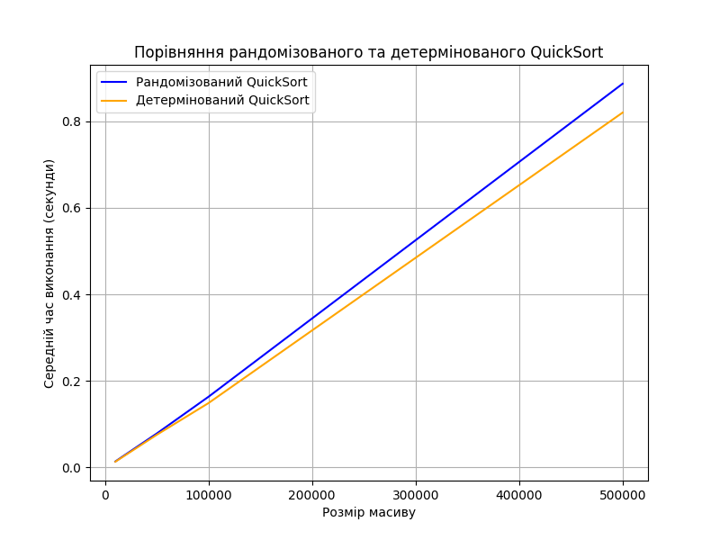

# goit-algo2-hw-10

# Завдання №1 

### Час виконання алгоритмів виміряний та представлений у вигляді таблиці та графіка:

| Розмір масиву | Рандомізований QuickSort (секунди) | Детермінований QuickSort (секунди) |
|--------------|----------------------------------|--------------------------------|
| 10 000      | 0.0140                           | 0.0132                         |
| 50 000      | 0.0802                           | 0.0742                         |
| 100 000     | 0.1707                           | 0.1665                         |
| 500 000     | 0.9130                           | 0.8464                         |

### Графіл:

### Аналіз результатів та висновки:

1. **Залежність часу виконання від розміру масиву**  
   - Час виконання обох алгоритмів зростає приблизно лінійно з розміром масиву.
   - Детермінований QuickSort працює трохи швидше, ніж рандомізований, що узгоджується з теоретичними очікуваннями.

2. **Різниця між алгоритмами**  
   - Для всіх тестованих масивів детермінований QuickSort показує трохи кращу продуктивність.
   - При **500 000 елементах** різниця стає більш помітною:  
     - **Рандомізований QuickSort:** 0.9130 сек  
     - **Детермінований QuickSort:** 0.8464 сек  
     Це підтверджує, що випадковий вибір опорного елемента може впливати на час виконання, особливо на великих масивах.

3. **Варіації часу виконання**  
   - Час виконання може змінюватися через особливості розподілу чисел у масиві.
   - Випадковий вибір опорного елемента іноді може призводити до поганого розбиття масиву.

#### **Висновки щодо ефективності QuickSort**
- **Детермінований QuickSort показав стабільніші та швидші результати.**  
  Використання середнього елемента як опорного зменшує ймовірність найгіршого випадку (O(n²)).
- **Рандомізований QuickSort може бути корисним у випадках, коли потрібно уникнути найгіршого випадку на вже відсортованих даних.**  
  Він підходить для сценаріїв, коли можливий вплив поганого вибору фіксованого pivot.

# Завдання №2

### Розклад занять:
- Наталія Шевченко, 29 років, email: n.shevchenko@example.com
   Викладає предмети: Хімія, Біологія

- Дмитро Бондаренко, 35 років, email: d.bondarenko@example.com
   Викладає предмети: Фізика, Інформатика

- Олександр Іваненко, 45 років, email: o.ivanenko@example.com
   Викладає предмети: Математика